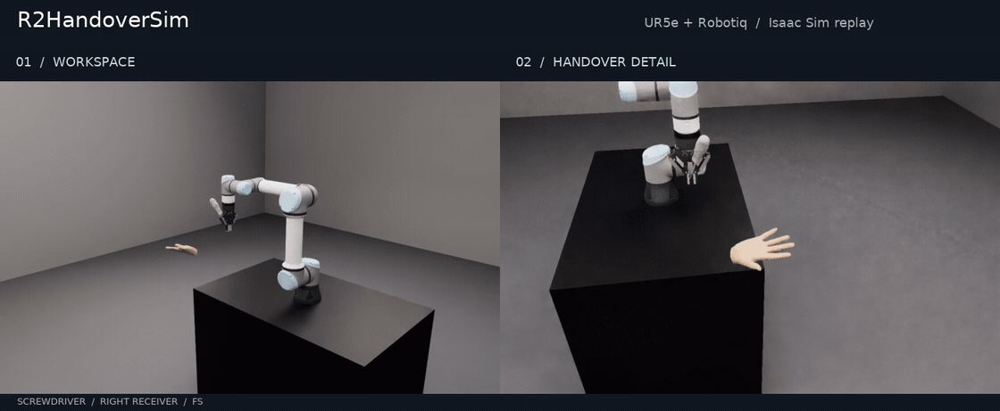
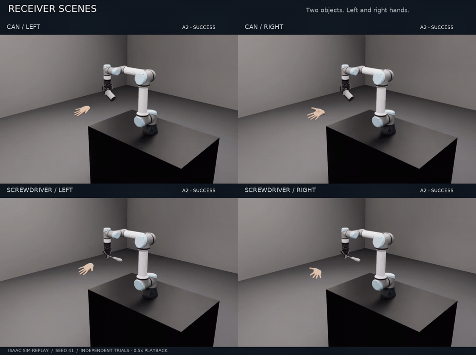
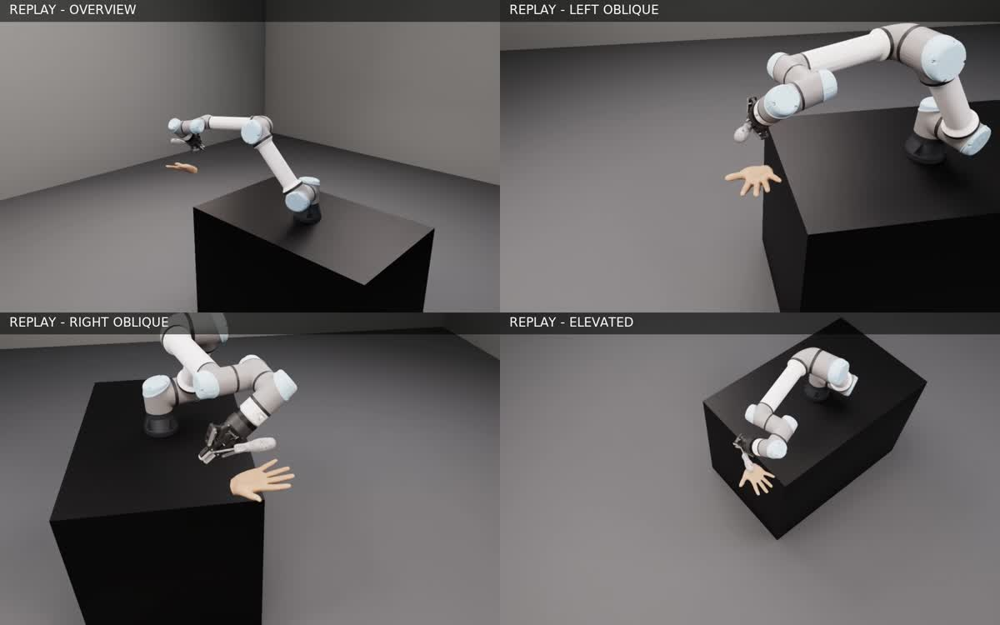

<div align="center">

# R2HandoverSim

**Robot-to-human handover, from a fixed receiving scene to a verifiable replay.**

UR5e · Robotiq 2F-85 · Object meshes · Left/right MANO receivers · NVIDIA Isaac Sim

[Project & paper](https://robot-future.github.io/r2handoversim/) · [Get started](docs/quickstart.md) · [Protocol](docs/protocol.md) · [Intent-Handover](https://github.com/Hanxin-Zhang/intent-handover)

</div>

[](https://github.com/Hanxin-Zhang/r2handoversim/releases/download/v0.11.0/handover-natural.mp4)

<p align="center"><b>One handover. Two synchronized views.</b><br>Original robot and object assets, fixed receiving hand, laboratory lighting.<br><a href="https://github.com/Hanxin-Zhang/r2handoversim/releases/download/v0.11.0/handover-natural.mp4">Download HD MP4 ↗</a></p>

## Explore the scenes

[](https://github.com/Hanxin-Zhang/r2handoversim/releases/download/v0.11.0/receivers-natural.mp4)

**Two objects × two receiving hands, using the A2 setting.** Full-arm views show each posture and motion. Seeded poses place the palm 0.67–0.85 m horizontally from the robot base. Each receiver stays fixed throughout planning and execution. [Download scene montage ↗](https://github.com/Hanxin-Zhang/r2handoversim/releases/download/v0.11.0/receivers-natural.mp4)

<details>
<summary><b>Inspect the same trajectory from four cameras</b></summary>

[](https://github.com/Hanxin-Zhang/r2handoversim/releases/download/v0.11.0/multiview-natural.mp4)

Overview, left, right and elevated views share the same trajectory and evaluated outcome. [Download synchronized views ↗](https://github.com/Hanxin-Zhang/r2handoversim/releases/download/v0.11.0/multiview-natural.mp4) · [Camera & lighting guide](docs/rendering.md)

</details>

## The handover protocol

**Prepare grasps → sample a receiver → select a grasp → plan & replay → evaluate.**

The robot starts with the object attached to its gripper. All method variants share the receiver pose and object target. Isaac Sim plans against original robot colliders, object hulls and hand triangles, then records the execution.

| Check | Evaluation |
|:---|:---|
| **Stability** | Object projection along the closing axis ≤ 85 mm |
| **Plan** | Full-pose IK and collision-checked RRT-Connect |
| **Reach** | Object enters the palm-relative region: 12 cm offset, 10 cm radius |
| **Affordance** | Fingers preserve the supplied human-usage region in S1 |
| **Safe** | Robot and receiving hand remain clear at every replay frame |

Results use this first-failure order; success requires all applicable checks. S0/S1 object means and their equally weighted average follow the paper's table convention. [Protocol and output schema →](docs/protocol.md)

## Run your first scene

**Environment:** Isaac Sim 5.0, its Python environment, and `ffmpeg` for recording. Validated on Linux with an RTX 4070.

**1 · Install**

```bash
git clone https://github.com/robot-future/r2handoversim.git
cd r2handoversim
python -m pip install -e '.[planning,assets]'
r2handoversim doctor --isaac --video
```

**2 · Configure & prepare**

Follow the [asset setup and scene preparation guide](docs/quickstart.md#configure-assets) to connect the UR5e/Robotiq USD, object OBJ, hand templates and grasp candidates. It produces `outputs/trials/trials.json` with paired method selections and fixed receivers.

**3 · Replay & record**

```bash
r2handoversim demo --trials outputs/trials/trials.json --headless \
  --visual-style lab --renderer pathtraced --camera right \
  --video --screenshot --animation --output outputs/replay
r2handoversim verify-output --input outputs/replay
```

Open **`outputs/replay/report.html`** for videos, metric flags and per-trial artifacts. Use `--renderer realtime` for faster iteration, or `--hold` in a GUI session for inspection.

## Keep every replay inspectable

| Output | What you can inspect |
|:---|:---|
| **MP4 / PNG / animated USD** | Motion, contact geometry and alternate views |
| **Resolved JSON + trajectory NPZ** | Joint states, tool/object poses, receiver identity and frame-level contacts |
| **HTML / CSV / JSON reports** | Evaluated success, first-failure attribution and S0/S1 summaries |

Reopen a resolved `*_trial.json` to render another camera view. For paper-reference browsing, `r2handoversim paper-replay` exports **8,000 reconstructed replay records** covering Table I's 108 cells; reference outcomes and evaluated simulator results have separate fields.

[Scene preparation](docs/quickstart.md) · [Receiver settings](docs/fixed_receivers.md) · [Rendering](docs/rendering.md) · [Validation](docs/validation.md) · [Releases](https://github.com/Hanxin-Zhang/r2handoversim/releases)

---

Code: [MIT](LICENSE). Configure original robot, object and MANO assets locally under their [source terms](THIRD_PARTY.md). Showcase media: [recording details](docs/media/README.md).

## Repository layout

- `src/`, `configs/`, `scripts/`, and `tests/`: simulator code and validation.
- `docs/index.html`, `docs/static/`, and `docs/assets/`: project showcase, served by GitHub Pages from `/docs`.
- Other files in `docs/`: simulator guides and replay media.

Simulator source imported from `Hanxin-Zhang/r2handoversim` at commit `de69dd05b2f71565be6b8a7d681c3cddf62be8d6`. Existing release-video links remain at their original hosting location.
